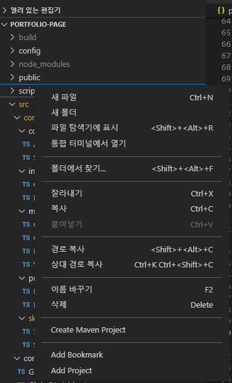
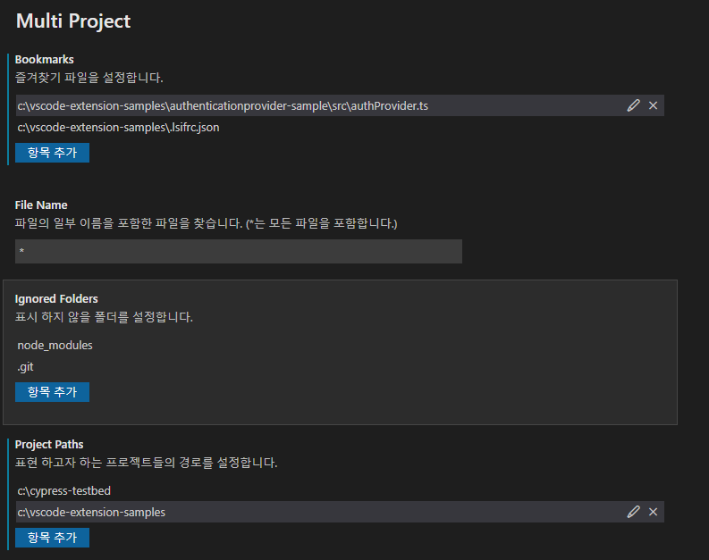
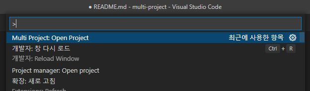

# multi-project README

Multi Project README

## Features

- set multi project no matter project path in single workspace
  - with configuration / explorer contextmenu
  - 
  - 
- set multi files (like bookmark) no matter file path in single workspace
  - with configuration / explorer contextmenu
- open project
  - with multi project explorer / open project command in command palette (ctrl + shift + p)
  - 

## Release Notes

### 1.0.0

Initial release
