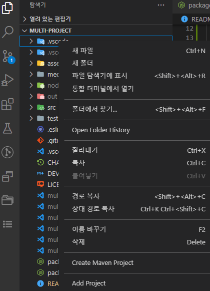
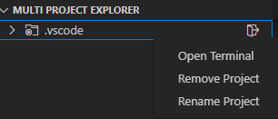
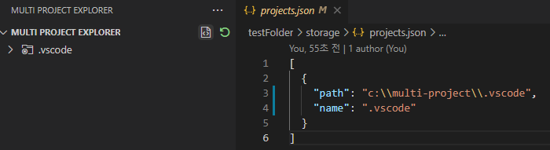
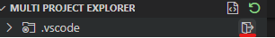
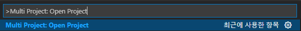

# Multi Project Extension

## Features

- Project Explorer

  1. Add Project

     - add a project or multi project from Explorer(ctrl + shift + E)
     - add a project from Multi Project Explorer

  2. Rename Project name

  3. Remove Project
  4. Ignore specific folders
  5. Open Terminal
  6. Sync Project with json file

     - you can add, remove, rename project through editing projects.json

  7. Quick open each project

     - search Multi Project: Open Project from command palette(ctrl + shift + p)
     - mouse over project then click door icon from Multi Project Explorer

- Bookmark Explorer

  1. Add Bookmark
     - add a bookmark or multi bookmark from Explorer(ctrl + shift + E)
     - add a bookmark from Multi Project Explorer
  2. Rename Bookmark name
  3. Sync Bookmark with json file
     - you can add, remove, rename bookmark through editing bookmarks.json

## How To Use

- Add Project
  - 
- Rename Project
- Remove Project
- Open Terminal

  - 

- Sync with json file

  - 

- Open Project
  - 
  - **_command palette(ctrl + shift + p)_**
  - 
